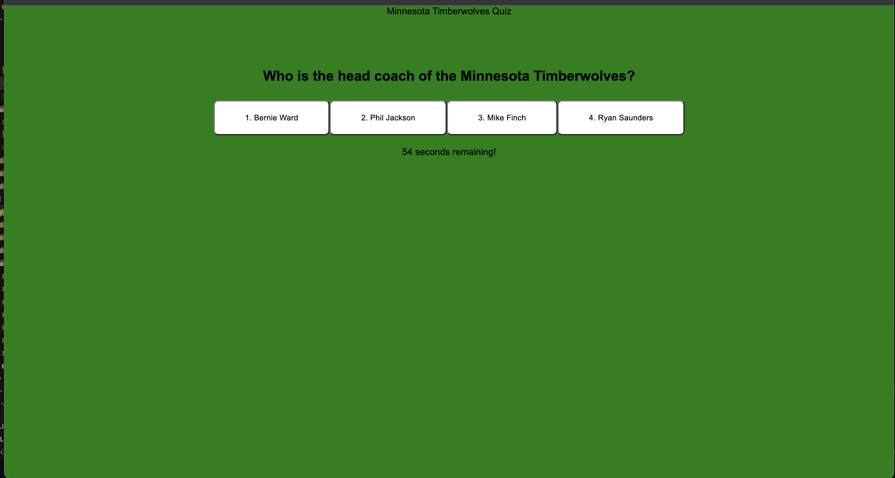

This is My quiz about the Minnesota Timberwolves. This is designed to test your knowledge about the Timberwolve!

The quiz has 4 questions. You are deduceted 10 seconds for every incorrect answer. The quiz functions completely fine. 

I got the timer to work and end with the quiz ending. I wrote a ton of code and spent a ton of time on this, but could not get the initials to come up on the webpage. I wrote code, that I feel like is correct, but I could not work through the errors to make it work so in other words, I do not feel like I am far off. 

REPO LINK: https://github.com/GrantMitchell24/code-quiz

GITHUB LINK: https://grantmitchell24.github.io/code-quiz

Author: Grant Mitchell

License: See Repo

